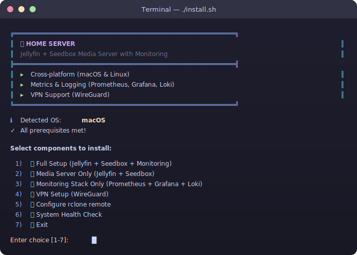
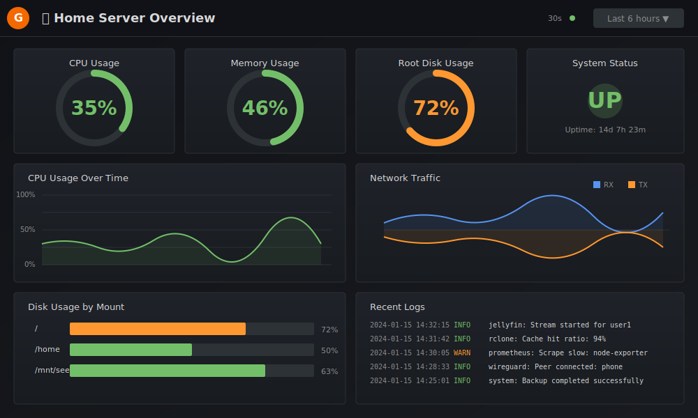
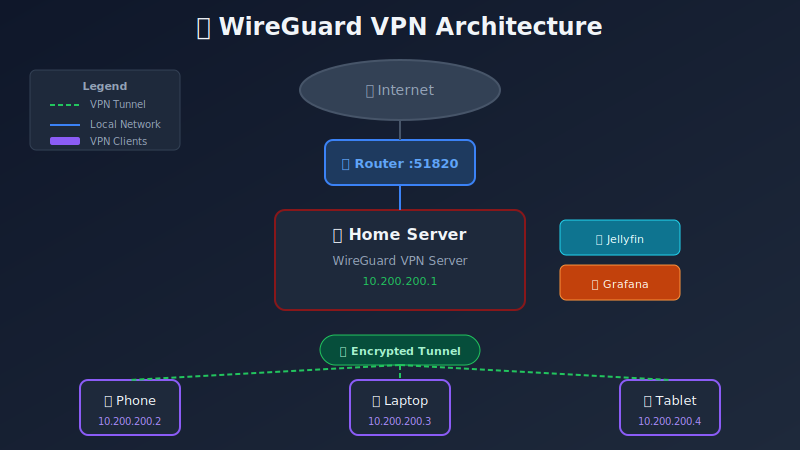
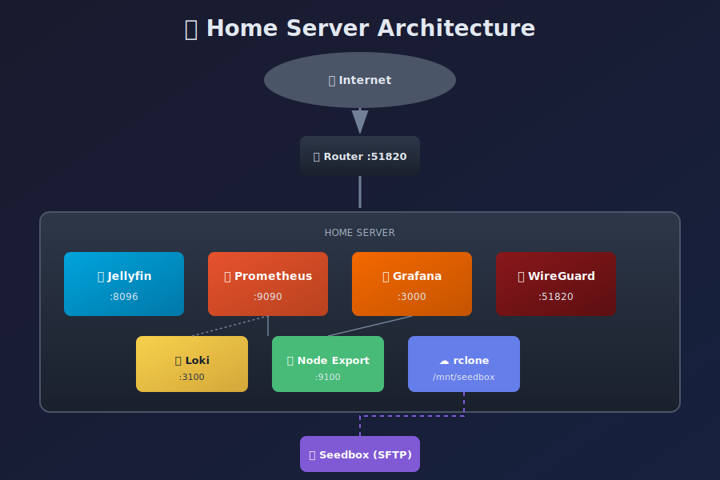

<p align="center">
  
</p>

<h1 align="center">Home Server</h1>

<p align="center">
  <strong>A cross-platform home media server with monitoring, metrics, and secure remote access</strong>
</p>

<p align="center">
  <a href="#features">Features</a> •
  <a href="#architecture">Architecture</a> •
  <a href="#quick-start">Quick Start</a> •
  <a href="#documentation">Documentation</a> •
  <a href="#screenshots">Screenshots</a>
</p>

<p align="center">
  
  
  
  
</p>

---

## Features

<table>
<tr>
<td width="50%">

### Media Server
- **Jellyfin** — Free, open-source media streaming
- **rclone** — Mount remote seedbox via SFTP
- **Persistent mounts** — Auto-reconnect on boot
- **Hardware transcoding** — GPU acceleration support

</td>
<td width="50%">

### Monitoring & Metrics
- **Prometheus** — Time-series metrics collection
- **Grafana** — Beautiful dashboards & visualization
- **Loki** — Centralized log aggregation
- **Alertmanager** — Smart alert routing

</td>
</tr>
<tr>
<td width="50%">

### Secure Remote Access
- **WireGuard VPN** — Fast, modern VPN protocol
- **QR Code generation** — Easy mobile setup
- **Split tunneling** — Route only home traffic
- **Multi-client support** — Connect all your devices

</td>
<td width="50%">

### Cross-Platform
- **Linux** — Ubuntu, Debian, Fedora, Arch
- **macOS** — Intel & Apple Silicon
- **Automated setup** — Interactive installer
- **Platform-specific optimizations**

</td>
</tr>
</table>

---

## Tech Stack

<p align="center">
  
  
  
  
</p>
<p align="center">
  
  
  
  
</p>

---

## Screenshots

<details>
<summary><b>Interactive Installer</b></summary>
<br>
<p align="center">
  
</p>
</details>

<details>
<summary><b>Grafana Dashboard</b></summary>
<br>
<p align="center">
  
</p>
</details>

<details>
<summary><b>VPN Architecture</b></summary>
<br>
<p align="center">
  
</p>
</details>

---

## Architecture

<p align="center">
  
</p>

<details>
<summary><b>Text Diagram</b></summary>

```
┌─────────────────────────────────────────────────────────────────────────────┐
│                              HOME SERVER                                     │
├─────────────────────────────────────────────────────────────────────────────┤
│                                                                             │
│  ┌─────────────┐    ┌─────────────┐    ┌─────────────┐    ┌─────────────┐  │
│  │   Jellyfin  │    │  Prometheus │    │   Grafana   │    │  WireGuard  │  │
│  │   :8096     │    │    :9090    │    │    :3000    │    │   :51820    │  │
│  └──────┬──────┘    └──────┬──────┘    └──────┬──────┘    └──────┬──────┘  │
│         │                  │                  │                  │         │
│         │           ┌──────┴──────┐           │                  │         │
│         │           │    Loki     │───────────┘                  │         │
│         │           │    :3100    │                              │         │
│         │           └──────┬──────┘                              │         │
│         │                  │                                     │         │
│  ┌──────┴──────────────────┴─────────────────────────────────────┴──────┐  │
│  │                         System Layer                                  │  │
│  │  ┌─────────────┐  ┌─────────────┐  ┌─────────────┐  ┌─────────────┐  │  │
│  │  │   rclone    │  │ Node Export │  │  cAdvisor   │  │  Promtail   │  │  │
│  │  │   mount     │  │    :9100    │  │    :8080    │  │   (logs)    │  │  │
│  │  └──────┬──────┘  └─────────────┘  └─────────────┘  └─────────────┘  │  │
│  └─────────┼────────────────────────────────────────────────────────────┘  │
│            │                                                               │
└────────────┼───────────────────────────────────────────────────────────────┘
             │
             ▼
      ┌─────────────┐
      │   Seedbox   │
      │   (SFTP)    │
      └─────────────┘
```

</details>

---

## Quick Start

### Prerequisites

| Platform | Requirements |
|----------|-------------|
| **Linux** | `curl`, `git`, Docker (optional for monitoring) |
| **macOS** | Homebrew, Docker Desktop (optional for monitoring) |

### Installation

```bash
# Clone the repository
git clone https://github.com/yourusername/home-server.git
cd home-server

# Make installer executable
chmod +x install.sh

# Run the interactive installer
./install.sh
```

### Install Options

```bash
./install.sh --full        # Full setup (Jellyfin + Seedbox + Monitoring + VPN)
./install.sh --media       # Media server only
./install.sh --monitoring  # Monitoring stack only
./install.sh --vpn         # VPN setup only
./install.sh --health      # System health check
```

---

## Project Structure

```
home-server/
├── install.sh                       # Main interactive installer
├── README.md
│
├── scripts/
│   ├── common/                      # Shared utilities
│   │   ├── colors.sh                # Terminal colors
│   │   ├── utils.sh                 # Helper functions
│   │   ├── health.sh                # Health check
│   │   └── monitoring.sh            # Monitoring deployment
│   │
│   ├── linux/                       # Linux-specific scripts
│   │   ├── setup.sh
│   │   ├── rclone.sh
│   │   └── vpn.sh
│   │
│   └── macos/                       # macOS-specific scripts
│       ├── setup.sh
│       ├── rclone.sh
│       └── vpn.sh
│
├── monitoring/                      # Docker-based monitoring stack
│   ├── docker-compose.yml
│   ├── prometheus/
│   ├── grafana/
│   ├── loki/
│   └── promtail/
│
├── vpn/
│   ├── wireguard/                   # Configuration templates
│   └── clients/                     # Generated client configs
│
├── config/
│   └── .env.example
│
└── docs/
    ├── LINUX.md
    ├── MACOS.md
    └── VPN.md
```

---

## Monitoring

The monitoring stack includes pre-configured Grafana dashboards:

| Dashboard | Metrics |
|-----------|---------|
| **System Overview** | CPU, Memory, Disk, Network |
| **Container Metrics** | Docker container stats via cAdvisor |
| **Logs Explorer** | Centralized logs from all services |
| **Alerts** | Active and historical alerts |

### Service URLs

| Service | URL | Default Credentials |
|---------|-----|---------------------|
| **Grafana** | `http://<server-ip>:3000` | admin / admin |
| **Prometheus** | `http://<server-ip>:9090` | — |
| **Alertmanager** | `http://<server-ip>:9093` | — |
| **Jellyfin** | `http://<server-ip>:8096` | Setup on first access |

---

## VPN Remote Access

WireGuard provides secure, high-performance VPN access to your home server from anywhere.

**Key Features:**
- Fast — significantly faster than OpenVPN
- Secure — modern cryptography (Curve25519, ChaCha20, Poly1305)
- Mobile Ready — QR codes for easy phone setup
- Split Tunnel — route only home network traffic through VPN

### Client Setup

1. Run VPN setup on server: `./install.sh --vpn`
2. Generate client config
3. Scan QR code with WireGuard app (iOS/Android)
4. Or import `.conf` file on desktop

### Supported Clients

| Platform | App |
|----------|-----|
| iOS | [WireGuard](https://apps.apple.com/app/wireguard/id1441195209) |
| Android | [WireGuard](https://play.google.com/store/apps/details?id=com.wireguard.android) |
| macOS | [WireGuard](https://apps.apple.com/app/wireguard/id1451685025) |
| Windows | [WireGuard](https://www.wireguard.com/install/) |
| Linux | `apt install wireguard` |

---

## Alerts

### Default Alert Rules

| Alert | Severity | Condition |
|-------|----------|-----------|
| High CPU | Warning | CPU > 80% for 5min |
| High Memory | Warning | Memory > 85% for 5min |
| Disk Space Low | Warning | Disk > 85% full |
| Disk Space Critical | Critical | Disk > 95% full |
| Host Down | Critical | Target unreachable for 1min |
| Seedbox Mount Down | Critical | Mount unavailable for 2min |

---

## Configuration

Copy and customize the example config:

```bash
cp config/.env.example config/.env
```

| Variable | Description | Default |
|----------|-------------|---------|
| `SEEDBOX_HOST` | Seedbox SFTP hostname | — |
| `SEEDBOX_PORT` | Seedbox SFTP port | `22` |
| `GRAFANA_ADMIN_PASSWORD` | Grafana admin password | `admin` |
| `VPN_SUBNET` | WireGuard VPN subnet | `10.200.200` |
| `VPN_PORT` | WireGuard UDP port | `51820` |

---

## Maintenance

### Health Check

```bash
./install.sh --health
```

### Common Commands

```bash
# View monitoring logs
cd monitoring && docker compose logs -f

# Restart monitoring stack
cd monitoring && docker compose restart

# Check rclone mount (Linux)
systemctl status rclone-seedbox

# Check rclone mount (macOS)
launchctl list | grep rclone

# WireGuard status
sudo wg show
```

---

## Security

1. **Change default passwords** — especially Grafana admin
2. **Keep services updated** — regular `docker compose pull`
3. **Firewall** — only expose necessary ports
4. **VPN** — use VPN for remote access instead of exposing services
5. **Backups** — regular backups of Grafana dashboards and configs

### Firewall Rules (UFW)

```bash
ufw allow 22/tcp                              # SSH
ufw allow from 192.168.0.0/16 to any port 8096  # Jellyfin (local only)
ufw allow 51820/udp                           # WireGuard
ufw default deny incoming
```

---

## Contributing

Contributions are welcome! Please feel free to submit a Pull Request.

1. Fork the repository
2. Create your feature branch (`git checkout -b feature/AmazingFeature`)
3. Commit your changes (`git commit -m 'Add some AmazingFeature'`)
4. Push to the branch (`git push origin feature/AmazingFeature`)
5. Open a Pull Request

---

## License

This project is licensed under the MIT License — see the [LICENSE](LICENSE) file for details.

---

## Acknowledgments

- [Jellyfin](https://jellyfin.org/) — Free Software Media System
- [rclone](https://rclone.org/) — Cloud storage Swiss army knife
- [Prometheus](https://prometheus.io/) — Monitoring system & TSDB
- [Grafana](https://grafana.com/) — Observability platform
- [WireGuard](https://www.wireguard.com/) — Fast, modern VPN
- [Loki](https://grafana.com/oss/loki/) — Log aggregation system
